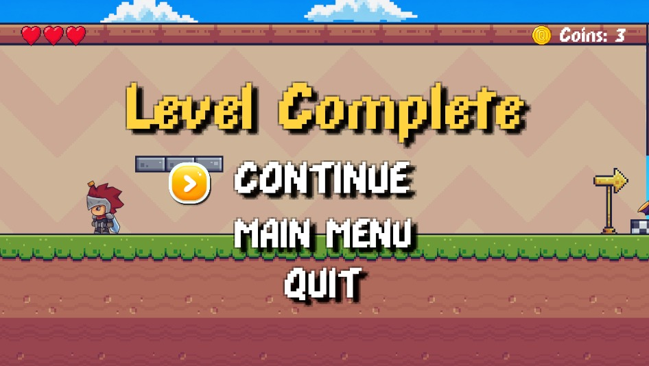

The Knight of Gold
The Knight of Gold adalah game platformer 2D yang dikembangkan menggunakan Unity dan bahasa pemrograman C#. Dalam permainan ini, pemain berperan sebagai seorang ksatria pemberani yang menjelajahi dunia penuh tantangan untuk mengumpulkan emas dan mencapai tujuan di setiap level.
Pemain dapat mengendalikan karakter untuk bergerak ke kiri dan ke kanan serta melompat untuk melewati berbagai rintangan yang menghalangi perjalanan. Selain kemampuan dasar tersebut, karakter juga dapat memanfaatkan mekanisme wall jump untuk melompati area yang sulit dijangkau dan menyeberangi celah yang tidak dapat dilewati dengan lompatan biasa. Sistem pergerakan yang responsif memungkinkan pemain untuk mengontrol karakter dengan lebih baik saat menghadapi berbagai tantangan di sepanjang permainan.
Selama permainan berlangsung, pemain akan menjelajahi lingkungan yang terdiri dari platform, jurang, dan berbagai hambatan lainnya. Setiap level dirancang untuk menguji ketepatan waktu, kemampuan mengendalikan karakter, serta strategi pemain dalam memanfaatkan fitur-fitur yang tersedia. Untuk menyelesaikan level, pemain harus berhasil mencapai area tujuan tanpa terjatuh atau terhalang oleh rintangan yang ada.
Game ini memanfaatkan sistem fisika 2D yang disediakan oleh Unity sehingga pergerakan karakter, gravitasi, dan interaksi dengan lingkungan terasa lebih realistis. Animasi karakter juga digunakan untuk memberikan pengalaman bermain yang lebih hidup, termasuk animasi saat berlari, melompat, dan berada di atas permukaan tanah.
The Knight of Gold dikembangkan sebagai proyek game platformer yang menggabungkan elemen petualangan dan keterampilan. Melalui desain level yang menantang serta mekanisme permainan yang sederhana namun menarik, game ini bertujuan memberikan pengalaman bermain yang menyenangkan sekaligus melatih ketelitian dan koordinasi pemain dalam menyelesaikan setiap tantangan yang dihadapi.
## Main Menu

## Main Menu

The main menu allows players to start the game and access available options.

## Level Preview

This screen provides a preview of the level before gameplay begins.

## Level Complete

This screen appears after the player successfully completes the level.
